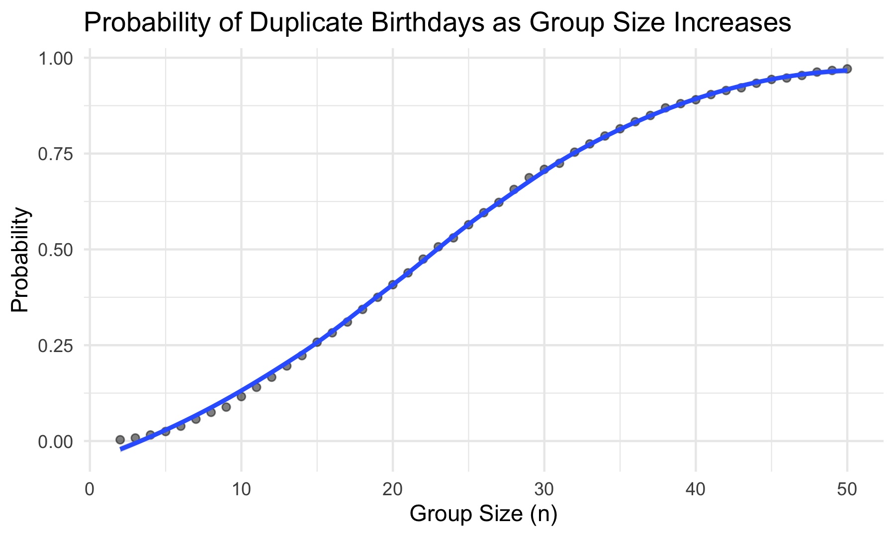
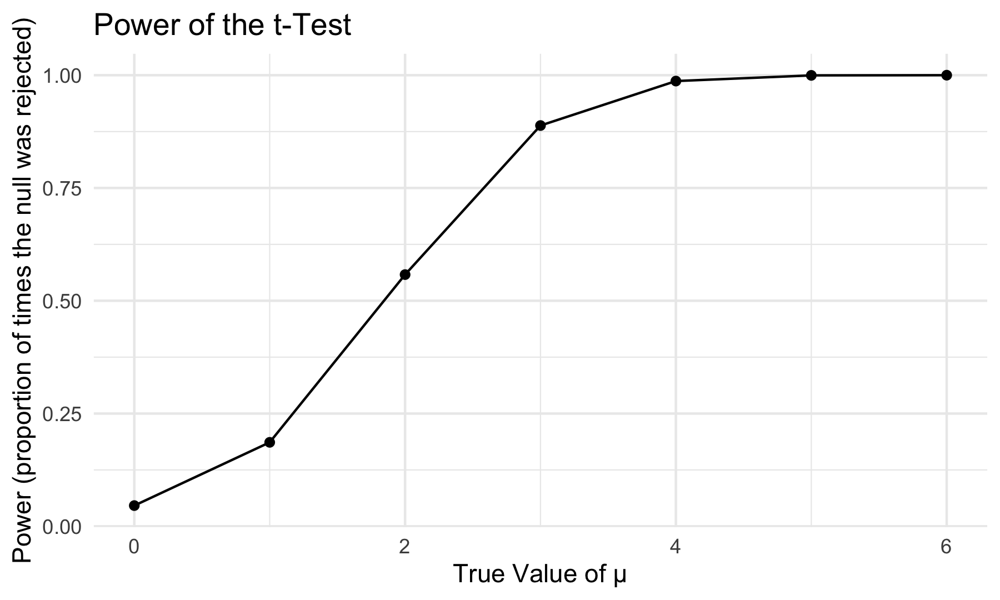
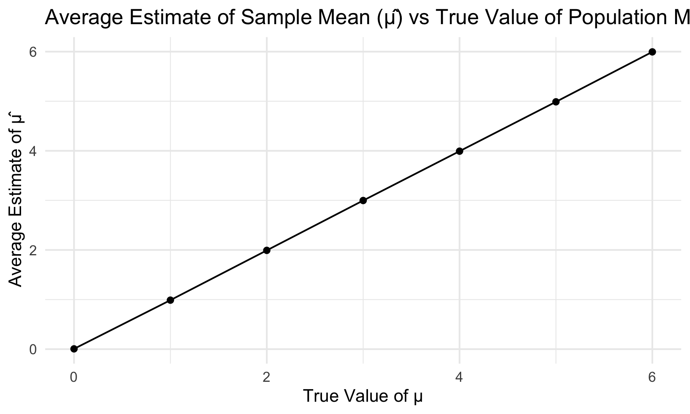
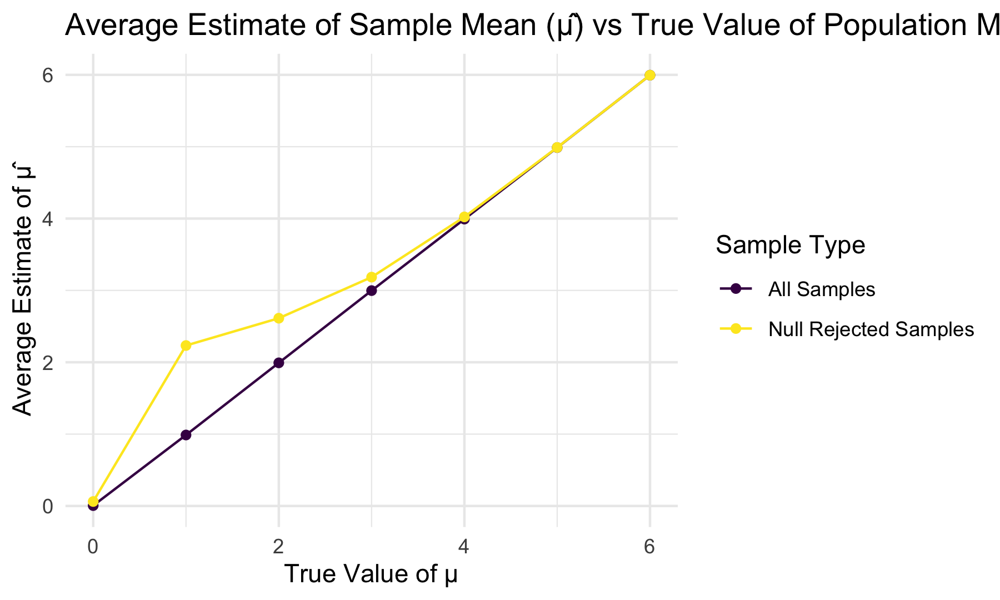
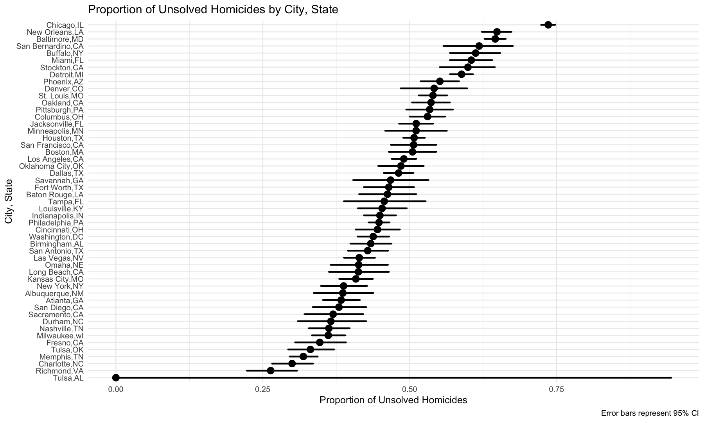

Homework 5 Iteration
================
Minghui Wang
2024-11-15

This assignment reinforces ideas in
[Iteration](https://p8105.com/topic_iteration.html).

Load key packages

``` r
library(tidyverse)
set.seed(123)
```

# Problem 1

Write a function that, for a fixed group size, randomly draws
“birthdays” for each person; checks whether there are duplicate
birthdays in the group; and returns TRUE or FALSE based on the result.

``` r
bday_sim = function(n) {

  bdays = sample(1:365, size = n, replace = TRUE)
  
  duplicate = length(unique(bdays)) < n

  return(duplicate)
}
```

Run this function 10000 times for each group size between 2 and 50. For
each group size, compute the probability that at least two people in the
group will share a birthday by averaging across the 10000 simulation
runs.

``` r
sim_res = 
  expand_grid(
    n = 2:50,
    iter = 1:10000
  ) |> 
  mutate(res = map_lgl(n, bday_sim)) |> 
  group_by(n) |> 
  summarize(prob = mean(res))
```

Make a plot showing the probability as a function of group size, and
comment on the results.

``` r
sim_res |> 
  ggplot(aes(x = n, y = prob )) + 
  geom_point(alpha=0.5) +
  geom_smooth()+
  labs(
    x= "Group Size (n)",
    y= "Probability",
    title = "Probability of Duplicate Birthdays as Group Size Increases"
  )
```

    ## `geom_smooth()` using method = 'loess' and formula = 'y ~ x'



**Comment** : The plot shows an increasing trend in the probability that
at least two people share a birthday as the group size grows. The
probability starts near zero for small groups but rises quickly,
reaching around 50% by a group size of 23, and approaching nearly 100%
by a group size of 50. The increasing rate is biggest around a group
size of 23 and smallest around 0 and 50. This plot demonstrates how the
likelihood of shared birthdays increases as more people are added.

# Problem 2

Define the function to save 𝜇̂ and the p-value arising from a test of
𝐻:𝜇=0 using 𝛼=0.05.

``` r
# Set parameters

alpha <- 0.05

# Define t_test function  
t_test = function(mu) {
  
  sample_data = rnorm(30, mean = mu, sd = 5)
  
  t_stat = t.test(sample_data, mu = 0) |>
    broom::tidy() |>
    select(estimate, p.value)
  
  return(t_stat)
}
```

``` r
# Generate 5000 dataset for mu = 0
sim_result_mu0 = 
  tibble(
    mu = 0,
    iter = 1:5000
  ) |>
  mutate(
    estimate_df = map(mu, t_test)
  ) |> 
  unnest(estimate_df)
```

``` r
# Simulation for each mu(1-6) value and store results
sim_result_mu1_6 =
  expand_grid(
    mu = 1:6,
    iter = 1:5000 )|>
  mutate(
    estimate_df = map(mu, t_test)
  )|> 
  unnest(estimate_df)

# Combine the two datasets
sim_result_df = bind_rows(sim_result_mu0, sim_result_mu1_6)
```

Make a plot showing the proportion of times the null was rejected (the
power of the test) on the y axis and the true value of 𝜇 on the x axis.
Describe the association between effect size and power.

``` r
sim_result_df |>
  group_by(mu) |>
  summarize(
    power = mean(p.value < alpha), .groups = 'drop')|>
  ggplot( aes(x = mu, y = power)) +
    geom_line() +
    geom_point() +
    labs(
      title = "Power of the t-Test ",
      x = "True Value of μ",
      y = "Power (proportion of times the null was rejected)"
    ) +
    theme_minimal()
```



**Comment** : The plot demonstrates that power increases with effect
size; as the true mean (𝜇) becomes larger, the probability of rejecting
the null hypothesis rises.When μ is small (close to 0), the power is
low, indicating a low probability of detecting a true effect.As μ
increases, the power steadily rises, and by the time μ reaches around 4,
the power approaches 1, meaning the test is highly likely to reject the
null hypothesis when it is false. This highlights the positive
relationship between effect size and the test’s ability to detect a true
effect.<br>

Make a plot showing the average estimate of 𝜇̂ on the y axis and the true
value of 𝜇 on the x axis.

``` r
sim_result_df |>
  group_by(mu) |>
  summarize(
    avg_mu = mean(estimate), .groups = 'drop')|>
  ggplot( aes(x = mu, y = avg_mu) )+
  geom_line() +
  geom_point() +
  labs(
      title = "Average Estimate of Sample Mean (μ̂) vs True Value of Population Mean (μ)",
      x = "True Value of μ",
      y = "Average Estimate of μ̂"
    ) +
    theme_minimal()
```



Make a second plot (or overlay on the first) the average estimate of 𝜇̂
only in samples for which the null was rejected on the y axis and the
true value of 𝜇on the x axis. Is the sample average of 𝜇̂ across tests
for which the null is rejected approximately equal to the true value of
𝜇? Why or why not?

``` r
sim_result_df |>
  group_by(mu) |>
  summarize(
    avg_mu_hat = mean(estimate),  
    avg_mu_hat_rejected = mean(estimate[p.value < 0.05]),  
    .groups = 'drop'
  ) |>
  ggplot(aes(x = mu)) +
  geom_line(aes(y = avg_mu_hat, color = "All Samples"), linetype = "solid") +
  geom_point(aes(y = avg_mu_hat, color = "All Samples")) +
  geom_line(aes(y = avg_mu_hat_rejected, color = "Null Rejected Samples"), linetype = "solid") +
  geom_point(aes(y = avg_mu_hat_rejected, color = "Null Rejected Samples")) +
  labs(
    title = "Average Estimate of Sample Mean (μ̂) vs True Value of Population Mean (μ)",
    x = "True Value of μ", y = "Average Estimate of μ̂", color = "Sample Type" ) +
  theme_minimal()
```



**Is the sample average of 𝜇̂ across tests for which the null is rejected
approximately equal to the true value of μ?**: The sample average of 𝜇̂
across tests for which the null hypothesis is rejected is not
approximately equal to the true value of μ, especially for smaller
values of μ.<br> **Why or why not?**: When we only consider samples
where the null hypothesis was rejected, we introduce selection bias.
This occurs because we are selectively choosing samples that show
stronger evidence against the null hypothesis, which typically results
in larger observed estimates. When the true effect size is small, only
the samples with higher-than-average estimates of 𝜇̂ will have a
significant p-value, and thus only those are included in the “null
rejected” category.However, when the true effect size is big, this bias
is reduced, resulting in the estimated value close to the true value.

# Problem 3

Load the raw dataset

``` r
homicide_raw = read_csv("https://raw.githubusercontent.com/washingtonpost/data-homicides/refs/heads/master/homicide-data.csv")
```

    ## Rows: 52179 Columns: 12
    ## ── Column specification ────────────────────────────────────────────────────────
    ## Delimiter: ","
    ## chr (9): uid, victim_last, victim_first, victim_race, victim_age, victim_sex...
    ## dbl (3): reported_date, lat, lon
    ## 
    ## ℹ Use `spec()` to retrieve the full column specification for this data.
    ## ℹ Specify the column types or set `show_col_types = FALSE` to quiet this message.

**Describe the raw data**<br> This dataset has 52,179 records about
incidents involving victims, with 12 columns describing each case. Each
record has a unique ID, the date it was reported (reported_date), and
victim information such as last name (victim_last), first name
(victim_first), race (victim_race), age (victim_age), and sex
(victim_sex), ect. The location of the incident is listed by city,
state, and geographic coordinates (latitude and longitude). The last
column, disposition, shows the outcome of the case, like “Closed without
arrest” or “Closed by arrest.” <br>

Create a city_state variable (e.g. “Baltimore, MD”) and then summarize
within cities to obtain the total number of homicides and the number of
unsolved homicides (those for which the disposition is “Closed without
arrest” or “Open/No arrest”).

``` r
homicide_unsolved = homicide_raw |>
  mutate(
    city_state = str_c(city, ",", state)) |>
  group_by(city_state)|>
  summarize(
    total_homicides = n(),
    total_unsolved = sum(disposition == "Closed without arrest" | disposition == "Open/No arrest")
  )
```

For the city of Baltimore, MD, use the `prop.test` function to estimate
the proportion of homicides that are unsolved; save the output of
`prop.test` as an R object, apply the broom::tidy to this object and
pull the estimated proportion and confidence intervals from the
resulting tidy dataframe.

``` r
baltimore = homicide_unsolved|>
  filter(city_state == "Baltimore,MD")


baltimore_prop_test =  prop.test(
  x = baltimore$total_unsolved,
  n = baltimore$total_homicides
)

broom::tidy(baltimore_prop_test) |>
  select(estimate, conf.low, conf.high)|>  
  knitr::kable()
```

|  estimate |  conf.low | conf.high |
|----------:|----------:|----------:|
| 0.6455607 | 0.6275625 | 0.6631599 |

Now run prop.test for each of the cities in your dataset, and extract
both the proportion of unsolved homicides and the confidence interval
for each. Do this within a “tidy” pipeline, making use of purrr::map,
purrr::map2, list columns and unnest as necessary to create a tidy
dataframe with estimated proportions and CIs for each city.

``` r
cities_prop_test = homicide_unsolved|>
  mutate(
    prop_test_result = map2(
      total_unsolved,
      total_homicides,
      ~ prop.test (x=.x,n=.y)),
    tidy_result = map (prop_test_result, broom::tidy)
  )|>
  select(city_state, tidy_result) |>
  unnest()|>
  select(city_state, estimate, conf.low, conf.high)

cities_prop_test |>
  knitr::kable()
```

| city_state        |  estimate |  conf.low | conf.high |
|:------------------|----------:|----------:|----------:|
| Albuquerque,NM    | 0.3862434 | 0.3372604 | 0.4375766 |
| Atlanta,GA        | 0.3833505 | 0.3528119 | 0.4148219 |
| Baltimore,MD      | 0.6455607 | 0.6275625 | 0.6631599 |
| Baton Rouge,LA    | 0.4622642 | 0.4141987 | 0.5110240 |
| Birmingham,AL     | 0.4337500 | 0.3991889 | 0.4689557 |
| Boston,MA         | 0.5048860 | 0.4646219 | 0.5450881 |
| Buffalo,NY        | 0.6122841 | 0.5687990 | 0.6540879 |
| Charlotte,NC      | 0.2998544 | 0.2660820 | 0.3358999 |
| Chicago,IL        | 0.7358627 | 0.7239959 | 0.7473998 |
| Cincinnati,OH     | 0.4452450 | 0.4079606 | 0.4831439 |
| Columbus,OH       | 0.5304428 | 0.5002167 | 0.5604506 |
| Dallas,TX         | 0.4811742 | 0.4561942 | 0.5062475 |
| Denver,CO         | 0.5416667 | 0.4846098 | 0.5976807 |
| Detroit,MI        | 0.5883287 | 0.5687903 | 0.6075953 |
| Durham,NC         | 0.3659420 | 0.3095874 | 0.4260936 |
| Fort Worth,TX     | 0.4644809 | 0.4222542 | 0.5072119 |
| Fresno,CA         | 0.3470226 | 0.3051013 | 0.3913963 |
| Houston,TX        | 0.5074779 | 0.4892447 | 0.5256914 |
| Indianapolis,IN   | 0.4493192 | 0.4223156 | 0.4766207 |
| Jacksonville,FL   | 0.5111301 | 0.4820460 | 0.5401402 |
| Kansas City,MO    | 0.4084034 | 0.3803996 | 0.4370054 |
| Las Vegas,NV      | 0.4141926 | 0.3881284 | 0.4407395 |
| Long Beach,CA     | 0.4126984 | 0.3629026 | 0.4642973 |
| Los Angeles,CA    | 0.4900310 | 0.4692208 | 0.5108754 |
| Louisville,KY     | 0.4531250 | 0.4120609 | 0.4948235 |
| Memphis,TN        | 0.3190225 | 0.2957047 | 0.3432691 |
| Miami,FL          | 0.6048387 | 0.5685783 | 0.6400015 |
| Milwaukee,wI      | 0.3614350 | 0.3333172 | 0.3905194 |
| Minneapolis,MN    | 0.5109290 | 0.4585150 | 0.5631099 |
| Nashville,TN      | 0.3624511 | 0.3285592 | 0.3977401 |
| New Orleans,LA    | 0.6485356 | 0.6231048 | 0.6731615 |
| New York,NY       | 0.3875598 | 0.3494421 | 0.4270755 |
| Oakland,CA        | 0.5364308 | 0.5040588 | 0.5685037 |
| Oklahoma City,OK  | 0.4851190 | 0.4467861 | 0.5236245 |
| Omaha,NE          | 0.4132029 | 0.3653146 | 0.4627477 |
| Philadelphia,PA   | 0.4478103 | 0.4300380 | 0.4657157 |
| Phoenix,AZ        | 0.5514223 | 0.5184825 | 0.5839244 |
| Pittsburgh,PA     | 0.5340729 | 0.4942706 | 0.5734545 |
| Richmond,VA       | 0.2634033 | 0.2228571 | 0.3082658 |
| Sacramento,CA     | 0.3696809 | 0.3211559 | 0.4209131 |
| San Antonio,TX    | 0.4285714 | 0.3947772 | 0.4630331 |
| San Bernardino,CA | 0.6181818 | 0.5576628 | 0.6753422 |
| San Diego,CA      | 0.3796095 | 0.3354259 | 0.4258315 |
| San Francisco,CA  | 0.5067873 | 0.4680516 | 0.5454433 |
| Savannah,GA       | 0.4674797 | 0.4041252 | 0.5318665 |
| St. Louis,MO      | 0.5396541 | 0.5154369 | 0.5636879 |
| Stockton,CA       | 0.5990991 | 0.5517145 | 0.6447418 |
| Tampa,FL          | 0.4567308 | 0.3881009 | 0.5269851 |
| Tulsa,AL          | 0.0000000 | 0.0000000 | 0.9453792 |
| Tulsa,OK          | 0.3310463 | 0.2932349 | 0.3711192 |
| Washington,DC     | 0.4379182 | 0.4112495 | 0.4649455 |

Create a plot that shows the estimates and CIs for each city – check out
geom_errorbar for a way to add error bars based on the upper and lower
limits. Organize cities according to the proportion of unsolved
homicides.

``` r
cities_prop_test |>
  mutate(
    city_state = reorder(city_state, estimate)
  )|>
  ggplot(aes(x = city_state, y = estimate)) +
  geom_point() +
  geom_errorbar(aes(ymin = conf.low, ymax = conf.high), width = 0.2) +
  coord_flip()+
  labs(
    title = "Proportion of Unsolved Homicides by City, State",
    x = "City, State",
    y = "Proportion of Unsolved Homicides",
    caption = "Error bars represent 95% CI"
  ) +
  theme_minimal(base_size = 6) 
```


