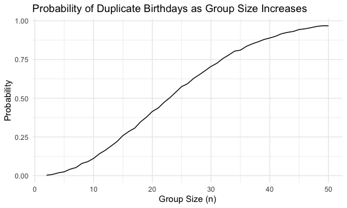

Homework 5 Iteration
================
Minghui Wang
2024-11-14

This assignment reinforces ideas in
[Iteration](https://p8105.com/topic_iteration.html).

# Problem 1

Write a function that, for a fixed group size, randomly draws
“birthdays” for each person; checks whether there are duplicate
birthdays in the group; and returns TRUE or FALSE based on the result.

``` r
bday_sim = function(n) {

  bdays = sample(1:365, size = n, replace = TRUE)
  
  duplicate = length(unique(bdays)) < n

  return(duplicate)
}
```

Run this function 10000 times for each group size between 2 and 50. For
each group size, compute the probability that at least two people in the
group will share a birthday by averaging across the 10000 simulation
runs.

``` r
sim_res = 
  expand_grid(
    n = 2:50,
    iter = 1:10000
  ) |> 
  mutate(res = map_lgl(n, bday_sim)) |> 
  group_by(n) |> 
  summarize(prob = mean(res))
```

Make a plot showing the probability as a function of group size, and
comment on the results.

``` r
sim_res |> 
  ggplot(aes(x = n, y = prob )) + 
  geom_line()+
  labs(
    x= "Group Size (n)",
    y= "Probability",
    title = "Probability of Duplicate Birthdays as Group Size Increases"
  )
```



**Comment** : The plot shows an increasing trend in the probability that
at least two people share a birthday as the group size grows. The
probability starts near zero for small groups but rises quickly,
reaching around 50% by a group size of 23, and approaching nearly 100%
by a group size of 50. The increasing rate is biggest around a group
size of 23 and smallest around 0 and 50. This plot demonstrates how the
likelihood of shared birthdays increases as more people are added. \#
Problem 2

# Problem 3
